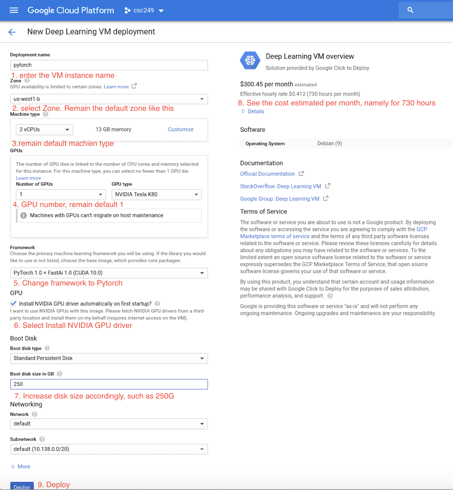

## Configure cloud project

1. **Create a new cloud project [here](https://console.cloud.google.com/cloud-resource-manager).**

   - You need a google account to log in.
   - When entering the above link, click `+CREATE PROJECT`, you will go to a new page.
   - Accept the term of service.
   - Enter the project name, such as 'csc249'.
   - Click `CREATE`.
   - There is a $300 promotion at the top of the page, click `ACTIVATE`
   - Filling out the payment page, which requires your payment method. But no worry, you have free $300 promotion and wont't be charged. Finally, click `START MY FREE TRIAL`
     **You won’t be charged unless you manually upgrade to a paid account**.

2. **Start DEEP-LEARNING-API**

   - Since we are using GPUs, we need to acquire the number of GPUs in [Quotas](https://console.cloud.google.com/quotas?_ga=2.186016044.-444096342.1547227127). The specific steps are as follows:

     - Update your account. **After updating your account, your billing account will be charged automatically since the $300 promotion runs out. So remember to unbind the billing account in time.**

     - Filter the metric, edit quota and send a GPU request.

       

     - Then a conformation email will be sent to your gmail. The request will be approved by email notification within a few hours

   - Go to [Deep Learning VM](https://cloud.google.com/deep-learning-vm/docs/pytorch_start_instance), follow the instruction of subsection *With one or more GPUs* in section *Creating a PyTorch Deep Learning VM instance from the Cloud Marketplace*. set up the VM instance by refering PyTorch Instance with one ore more GPUs. 

     - After Launch on Compute Engine, you can configure the VM as 

   - Once the VM has been deployed, the page will update with instructions for accessing the instance as . Remember the ssh connection command to the VM.

   - Next step is to install cloud sdk described in section [Install cloud sdk](#cloudsdk).

   - Create ssh connection to your machine 

     `gcloud compute ssh --project testpytorch-228322 --zone us-west1-b pytorch-1-vm -- -L 8080:localhost:8080`

   - Copy file from ML VM

     `gcloud compute scp --project testpytorch-228322 --zone us-west1-b --recurse <local file or directory> pytorch-1-vm:~/`

     

   By refering [here](https://cloud.google.com/deep-learning-vm/docs/pytorch_start_instance), select with one or more GPUs.

3. **Enabling billing**

   If your google accout only have one account, skip it. If you have many account, select one of them for the payment of the ML-engine by referring [here](https://support.google.com/cloud/answer/6293499#enable-billing).

   
## Install cloud sdk 

`conda create -n python2.7 python=2.7`

`source activate python2.7`

install [google cloud sdk](https://cloud.google.com/sdk/docs/quickstart-macos#before-you-begin)

